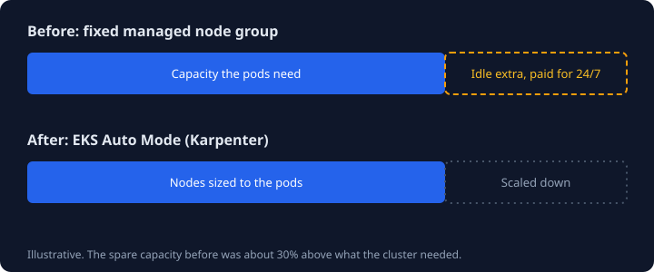
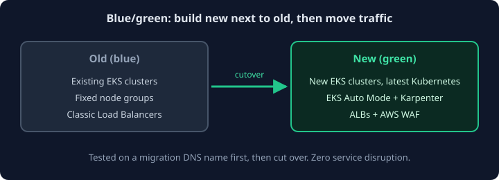

Before I joined the company, our EKS clusters did not scale at all. They ran on managed node groups with no cluster
scaling, and each group had the same desired, minimum and maximum instance count. I moved the clusters to dynamic
node scaling with EKS Auto Mode. The result was about **$50k/year** in AWS compute savings, with zero service
disruption.

  
<strong>$50k/yr</strong>AWS compute saved

  
<strong>~30%</strong>idle extra capacity before

  
<strong>0</strong>service disruption

## The problem with fixed node groups

We ran four EKS clusters, one for each environment. All of them used managed node groups with a fixed instance
count: the desired, minimum and maximum were all the same, and nothing scaled the cluster up or down. We sized them
roughly 30% above what the cluster actually needed, so that there would always be room when pods had to scale. This
had a few consequences:

- The cluster sat idle most of the time, in every environment, and production was the worst case.
- We paid for that extra 30% around the clock, and with four clusters the cloud costs were huge.

## Starting with an investigation

Before committing to anything, we ran an investigation to find out whether migrating to EKS Auto Mode was even
possible for us. [EKS Auto Mode](https://docs.aws.amazon.com/eks/latest/userguide/automode.html) runs
[Karpenter](https://karpenter.sh/) for you, so nodes are created only when pods need them.

The main blocker was our load balancers. We were using Classic Load Balancers, which operate at layer 4, and EKS
Auto Mode works with Application Load Balancers, which operate at layer 7. That is not a like-for-like swap, so
the real question was how to get from one to the other.

At first we tried to keep the Classic Load Balancers. Auto Mode was new at the time, and when we talked to AWS
support, they told us it was possible. It was not. We had to find that out ourselves, and the only way forward was
to migrate to ALBs.

To work out how, we built a proof of concept: a separate EKS cluster, set up with an ALB and a set of application
workloads, to act as a migration cluster. We ran end-to-end tests against it to make sure everything worked behind
the ALB. The result was clear. Migrating everything to ALBs was perfectly feasible, with no loss for our company
workloads, and the proof of concept gave us every step we needed to do it.

## Building the new clusters

### ALBs from Auto Mode

EKS Auto Mode runs the AWS load balancer controller for you. To make it provision our ALBs automatically, we added
an `IngressClass` and `IngressClassParams` to the cluster
([docs](https://docs.aws.amazon.com/eks/latest/userguide/auto-configure-alb.html)). After that, every `Ingress` that uses this class gets
its own ALB in AWS, with no manual setup.

### Provisioning with Terraform

We wrote a new Terraform module that provisions EKS Auto Mode, so every environment gets its cluster from the
same code.

### Node pools and scaling

Once the investigation showed the migration was feasible, we moved the workloads to dynamic scaling. A few notes
from the migration:

- **Split workloads with your own `NodePool` and `NodeClass`.** We separated workloads by type and used a
  `nodeSelector` to place each one on the right instances. Data workloads need more memory, so they run on
  memory-optimized `r8i` instances. Application workloads run on `m8i`, which are more well-rounded.
- **Let consolidation do its job.** Auto Mode packs workloads together and removes nodes that are underused, so
  there is nothing extra to switch on.
- **Set `NodePool` limits.** We set ours to 100% more than the cluster normally uses, based on its usage
  patterns. That leaves room to grow, but one misbehaving deployment cannot scale up a large number of expensive
  instances.
- **Use Spot for workloads that are not critical.** We created Spot nodes for these workloads and assigned their
  pods to them. They tolerate interruptions fine. Critical workloads stay on On-Demand.
- **Set disruption budgets on your `NodePool`.** We configured them so that nodes only rotate outside of spike
  hours, during the US night. This keeps node rotation away from peak traffic.
- **Check your pod disruption budgets.** Consolidation will happily evict pods to pack things more efficiently,
  so make sure your PDBs reflect what you can really tolerate.

## Migrating with blue/green

We never modified the existing clusters. Instead, we built new EKS clusters alongside them and moved over using a
blue/green approach. This also let us upgrade Kubernetes from 1.27 to 1.29 along the way.

While the new clusters were being built, we used a separate migration DNS name to test everything on them
temporarily, without touching live traffic. Once we were happy with the results, we did the cutover. Each migration took two days
at most, so the old and new clusters only ran side by side for a short time.

Rolling back was easy: we could simply go back to the old cluster. Our databases live outside the cluster. The ELK
stack did run inside it, but our backups are automated, so restoring them into a new StatefulSet on the new cluster
was simple.

## The outcome

Because we had four clusters, one per environment, the cost of idle capacity added up fast. Moving all of them to
Auto Mode saved about $50k/year in AWS compute, and there was no service disruption during the migration. The
platform also improved in other ways:

- **Efficiency.** Our systems scale whenever they need to, and nodes match the workloads running on them.
- **Load balancing.** We finally retired the Classic Load Balancers and moved to ALBs.
- **Security.** With ALBs in place, we added AWS WAF to restrict access to our systems, reduce bot traffic and
  block high-risk countries.

The main lesson: do not take it for granted that something will work, even when the vendor says it will. We only
learned that keeping Classic Load Balancers was not possible by building a proof of concept and testing it.
