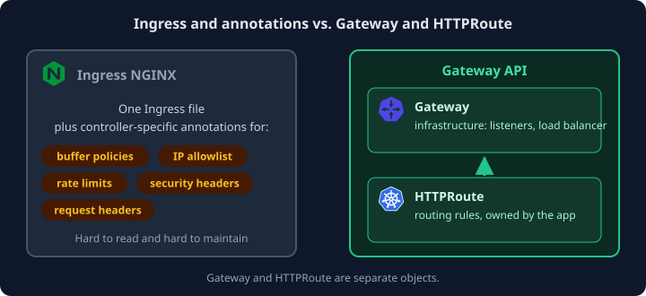
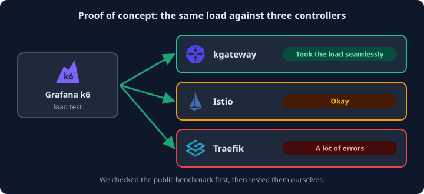
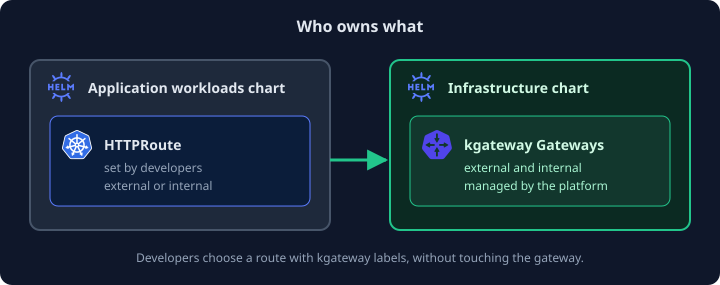
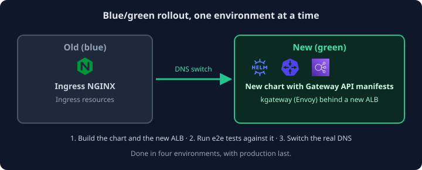

Kubernetes announced that Ingress NGINX would no longer be supported, and we had to make a decision. Should we move
to a different Ingress controller? Or should we skip that and do a big-bang cutover to the Gateway API, with a
Gateway controller installed?

We had a lot riding on the answer. Over time we had built up many small configurations in Ingress NGINX that would
need a new home: buffer policies, IP allowlists, rate limits, security headers and request headers. In the end, the
deprecation turned out to be the best thing that could have happened to us, for both maintainability and
performance.

## Ingress or Gateway API?

We started with an investigation: Gateway API against Ingress. The difference was clear. With Ingress, we had to
rely on ugly NGINX annotations in our Ingress files. The Gateway API is much better. It separates the
infrastructure (`Gateway` objects) from the routing rules (`HTTPRoute` objects), so each can be owned by the people
who care about it.

Once we agreed that the Gateway API was the way to go, we moved on to choosing a controller.

## Choosing a controller

We did a vendor selection, and the final three were [kgateway](https://kgateway.dev/), Istio and Traefik. We had
looked at the [gateway-api-bench](https://github.com/howardjohn/gateway-api-bench) benchmark, but we decided to
test them ourselves.

We set up a proof of concept and used [Grafana k6](https://k6.io/) to load test the three controllers against each
other. We had a clear winner.

We chose kgateway, which is built on Envoy.

## Migrating the Ingress resources

Next we had to move every Ingress over to the Gateway API. Kubernetes has a tool for this,
[ingress2gateway](https://github.com/kubernetes-sigs/ingress2gateway), and it made the process much easier. Two
things still needed our own work:

1. **An auth adapter.** We relied on an NGINX proxy that redirected traffic to another endpoint before it went to
   the internal service. To keep this working, we had to build an auth adapter with NGINX.
2. **Rate limits.** Rate limiting is configured differently in kgateway than in NGINX, and there were a lot of
   differences between the two.

## A better setup for developers

We added the `HTTPRoute` objects to our application workloads Helm chart, and set up the kgateway `Gateway`
objects in a separate infrastructure Helm chart. The result is that developers can now configure external and
internal routes very easily, using kgateway labels in an abstract way.

## How we rolled it out

We used a blue/green approach. We created a separate chart with the Gateway API manifests and a new ALB pointing
to it. We ran end-to-end tests against the new ALB, and then switched the real DNS over to it.

We did this in four environments, with production last.

## The outcome

The difference in performance was massive. Ingress NGINX being deprecated was something we feared, because of all
the small configurations we would have to move. But once we had finished, it was the best thing that could have
happened to us, from both a maintainability and a performance point of view.
